## EMD

EMD: Empirical Mode Decomposition

### 特征

1. 自适应。与小波分析相比，克服了基函数无自适应性的问题，解决了全局最优小波基在局部并非最优的问题，有基函数自适应特性。
2. 可以直接进行分解，不需要预分析和研究。

### 内涵模态分量

内涵模态分量（Intrinsic Mode Functions, IMF）就是原始信号被EMD分解之后得到的各层信号分量。EMD的提出人黄锷认为，任何信号都可以拆分成若干个内涵模态分量之和。而内涵模态分量有两个约束条件：

1）在整个数据段内，极值点的个数和过零点的个数必须相等或相差最多不能超过一个。

2）在任意时刻，由局部极大值点形成的上包络线和由局部极小值点形成的下包络线的平均值为零，即上、下包络线相对于时间轴局部对称。

啥意思？

用不严谨的语言和灵魂画师来解释一下：

1）图线要反复跨越x轴，像这样：

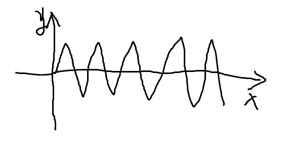

在整个数据段内，极值点的个数和过零点的个数必须相等或相差最多不能超过一个

而不能像这样某次穿过零点后出现多个极点：

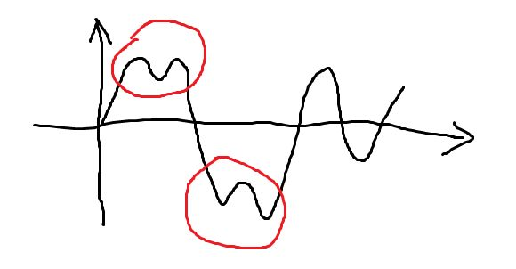

2）包络线要对称，像这样：

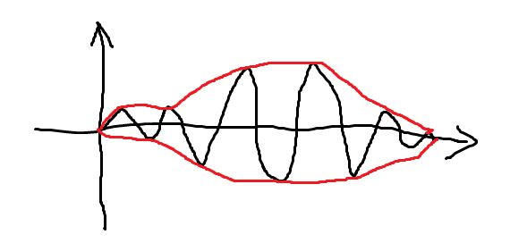

而不能像这样：

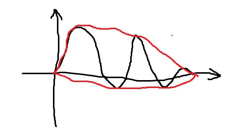

洗洗眼睛，看个正常点的例子吧：

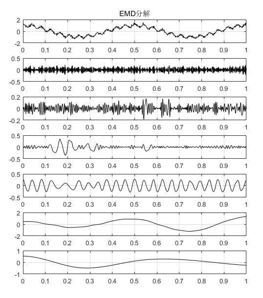

上图由7张图片组成，其中第1张为原始信号，后边依次为EMD分解之后得到的6个分量，分别叫做IMF1~IMF5，最后一张图为残差，每一个IMF分量代表了原始信号中存在的一种内涵模态分量。可以看出，每个IMF分量都是满足这两个约束条件的。

### 分解步骤

1）根据原始信号上下极值点，分别画出上、下包络线。

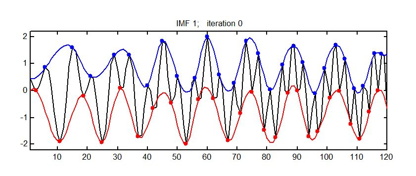上、下包络线

2）求上、下包络线的均值，画出均值包络线。

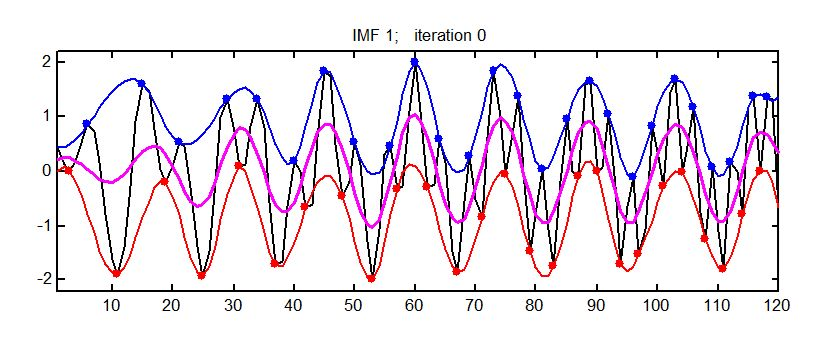均值包络线

3）原始信号减均值包络线，得到中间信号。

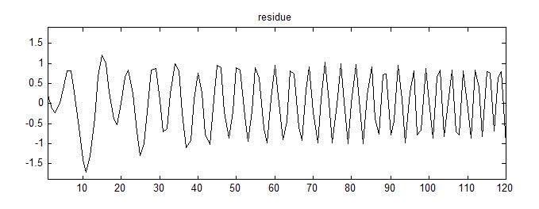原始信号减均值包络线

4）判断该中间信号是否满足IMF的两个条件，如果满足，该信号就是一个IMF分量；如果不是，以该信号为基础，重新做1）~4）的分析。IMF分量的获取通常需要若干次的迭代。

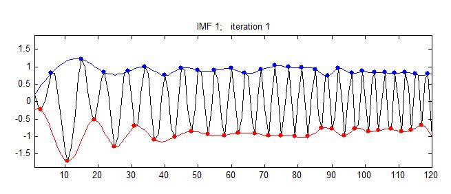不满足约束2，需要继续迭代

使用上述方法得到第一个IMF后，用原始信号减IMF1，作为新的原始信号，再通过1）~4）的分析，可以得到IMF2，以此类推，完成EMD分解。

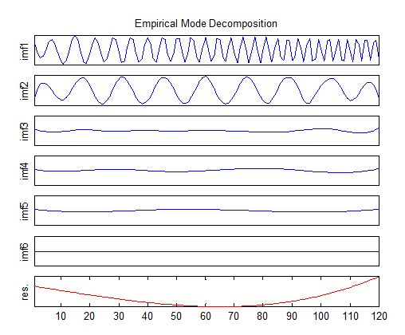迭代分解结果

上述例子中的图来自[http://perso.ens-lyon.fr/patri](http://perso.ens-lyon.fr/patrick.flandrin/emd.ppt)

## EEMD 

EEMD: Ensemble Empirical Mode Decomposition

简单的说，EEMD是在EMD的基础上，对原始信号进行了N次添加各异等幅白噪声并分别进行EMD分解后，对每个IMF中间分量进行平均。

其原理是通过加入白噪声来改变信号极值点的分布，得到符合信号特征的上下包络线，消除模态混叠效应。加入的白噪声通过多次平均消除。

## CEEMD 

CEEMD是在EEMD的基础上，把随机添加的N组白噪声改为了N/2组正噪声和N/2组负噪声，依旧是最后进行平均。

根据 Yeh 等人的研究，在加入相同数量以及相同幅值的白噪声时，EEMD 剩余噪声会随着集成平均的次数而逐渐减小。CEEMD 的剩余噪声一直维持在一个较小的程度，不论集成平均次数多少。在一定程度上使用 CEEMD方法进行信号分解，可以使用相对较少的集成平均次数，从某种意义上来说，CEEMD在保证小剩余噪声干扰的情况下，能够节省计算时间。

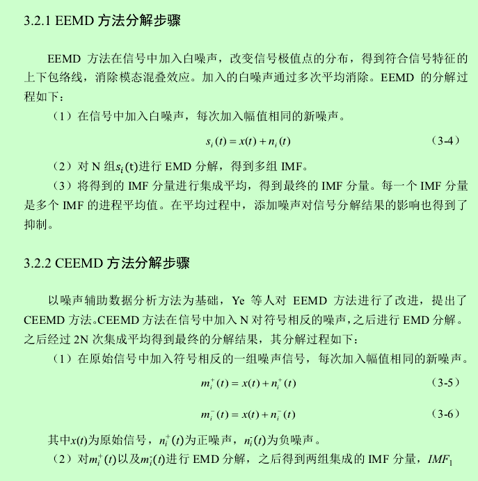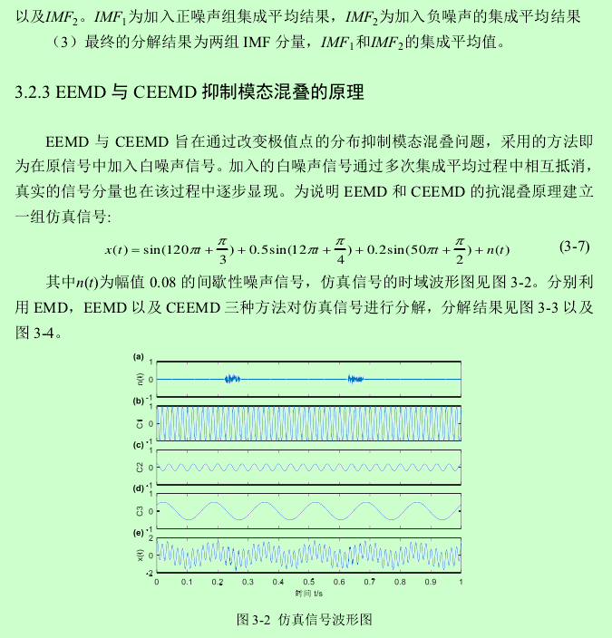

## Python库

EMD, EEMD, CEEMDAN and some visualization support are contained in this repository. 

We can use `pip install EMD-signal` to install this library.

## 引用

1. [EMD——EEMD——CEEMD语音增强算法基础](https://www.cnblogs.com/Dinging006/p/10282993.html)
2. [这篇文章能让你明白经验模态分解（EMD）——基础理论篇](https://zhuanlan.zhihu.com/p/40005057)
3. [这篇文章能让你明白经验模态分解（EMD）——IMF的物理含义](https://zhuanlan.zhihu.com/p/44833026)
4. [Ensemble Empirical Mode Decomposition: a Noise-Assisted Data Analysis Method](https://www.researchgate.net/publication/220531146_Ensemble_Empirical_Mode_Decomposition_a_Noise-Assisted_Data_Analysis_Method)