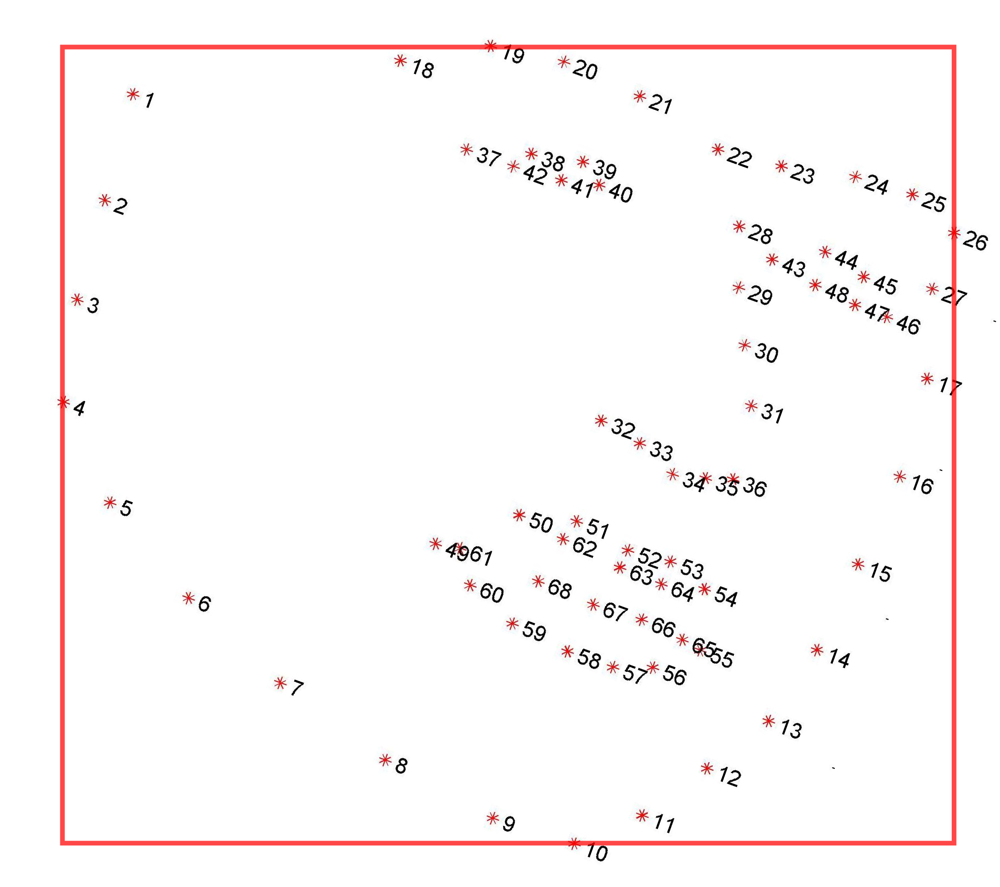
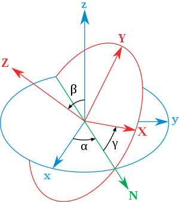

## Some Facts

1. The output of face detector is not always the same, it can be a square, a rectangle, or an oval bounding box. 
2. Most of the landmark detectors need to take in an square bounding box for the detection. 
3. Although the bounding box shape is different, they roughly have the same shape center. For the square and rectangle, they have the same bounding box center, and the edge length of the square box is roughly the same as the mean value of the two edge lengths of the rectangle. Here is a sample.

> White: Dlib Result
>
> Green: RetinaFace Result
>
> Red: RetinaFace Transferred Result (Same center, length=(width+height)/2)

4. Many face detection and alignment models has an absolute detectable face size range in pixel. If the input image contains a face too big, some network cannot generate correct face bounding box or landmark, like RetinaFace, SFD, Hrnet. On the other hand, if the input image contains faces too small(also in absolute pixel), other network like MTCNN and other traditional method will fail.

## Libraries and Papers

### Face Detection

#### Datasets

| Name       | Site                                                         | Description                                                  |
| ---------- | ------------------------------------------------------------ | ------------------------------------------------------------ |
| Wider Face | [Link](http://shuoyang1213.me/WIDERFACE/)                    | **32,203** images, **393,703** faces labeled with a high degree of variability in scale, pose and occlusion |
| FFDB       | [Link](http://vis-www.cs.umass.edu/fddb/)                    | **5171** faces, in which **2845** images from the [Faces in the Wild](http://tamaraberg.com/faceDataset/index.html) data set |
| AFLW       | [Link](https://www.tugraz.at/institute/icg/research/team-bischof/lrs/downloads/aflw/) | **25k faces** are annotated with up to **21 landmarks** per image |
|            |                                                              |                                                              |

#### Researches

| Name                                                         | Paper                                          | Code                                                         | Year | Accuracy                                         | Pre-trained Model                                            |
| ------------------------------------------------------------ | ---------------------------------------------- | ------------------------------------------------------------ | ---- | ------------------------------------------------ | ------------------------------------------------------------ |
| [RetinaFace](https://www.paperswithcode.com/paper/190500641) | [Link](https://arxiv.org/pdf/1905.00641v2.pdf) | [ Original](https://github.com/deepinsight/insightface) [ Pytorch](https://github.com/biubug6/Pytorch_Retinaface) | 2019 | Wider Face (Hard): 0.914                         | 104M(Resnet) [2M(MobileNet0.25)](https://drive.google.com/drive/folders/1oZRSG0ZegbVkVwUd8wUIQx8W7yfZ_ki1) |
| [DFSD](https://www.paperswithcode.com/paper/dsfd-dual-shot-face-detector) | [Link](https://arxiv.org/pdf/1810.10220v3.pdf) | [Link](https://github.com/TencentYoutuResearch/FaceDetection-DSFD) | 2018 | FDDB: 0.991 Wider Face: 0.960, 0.953, 0.900 | [459MB](https://drive.google.com/file/d/1WeXlNYsM6dMP3xQQELI-4gxhwKUQxc3-/view) |
| [SFD/S3FD](SFD/S3FD)                                         | [Link](https://arxiv.org/pdf/1708.05237.pdf)   | [Original](https://github.com/sfzhang15/SFD) [Pytorch](https://github.com/yxlijun/S3FD.pytorch) | 2017 | FDDB: 0.983 Wider Face: 0.928, 0.913, 0.840 | [85.7M](https://pan.baidu.com/s/1epyTAUc6qSt3oZ7veK4oEw)     |
| [MTCNN](https://www.paperswithcode.com/paper/joint-face-detection-and-alignment-using) | [Link](https://arxiv.org/abs/1604.02878)       | [Original](https://github.com/kuaikuaikim/DFace) [Pip Version](https://github.com/ipazc/mtcnn) | 2016 | Wider Face: 0.851,  0.820, 0.607                 | [2.85M](https://github.com/ipazc/mtcnn/blob/master/mtcnn/data/mtcnn_weights.npy) |

##### RetinaFace Pros & Cons:

RetinaFace can generate an accurate rectangle face bounding box together with a 5-points facial landmark. It supports two backbone kernels: Resnet and MobileNet. The first one is more accurate but relatively slow, the MobileNet version is fast and really small.

RetinaFace focus more on the detection of the relatively small faces, and it can do a good(best) job on wider face dataset hard level. However, when the input is an image contain a really large face(About ${short\_face\_edge}>700\space pixel $ ), RetinaFace tend to fail. Since there is also other people asking the same question on the issue of its GitHub page, I tend to think this is a design defects of RetinaFace.

Since the game streamers' face videos can be relatively large, I think this may become a fatal drawback. There are three possible solutions:

1. Scale the input image to make sure the largest face short edge is smaller than 700, recommend around 500.
2. Wait for the author to change or change the pyramid weights parameters. This is delicate and success is not guaranteed.

##### Other Models

DFSD can behave well on both easy, medium and hard level of Wider Face dataset. The only drawback is that it is much too large and slow. Not to mention real-time, it is even too heavy for GPU prediction when the input is a video and we also need to predict other features.

SFD has the similar problem as RetinaFace. It will also fail at big face cases. 

MTCNN is just really small and easy to use. It is wrapped finely into a pip package and we can use one line to do face detection here. It behaves much worse in small faces, but better when the input face is big compared to other method. In fact, MTCNN might be a good choice for our project, since it is friendly to big face and fast enough.

#### Wrapped Libraries 

| Name            | Site                                                         | Year      | Language     | Pip (Name)        |
| --------------- | ------------------------------------------------------------ | --------- | ------------ | ----------------- |
| Dlib            | [Link](http://dlib.net/)                                     | 2006->now | C++ & Python | √ dlib            |
| OpenFace V1     | [Home Page](http://cmusatyalab.github.io/openface/) [GitHub](https://github.com/cmusatyalab/openface) | 2016      | Python & Lua | × conda           |
| OpenFace V2     | [Link](https://github.com/TadasBaltrusaitis/OpenFace)        | 2018      | C++          | × compile locally |
| facenet-pytorch | [Link](https://pypi.org/project/facenet-pytorch/)            | 2017      | Python(PT)   | √ facenet-pytorch |
| MTCNN           | [Link](https://pypi.org/project/mtcnn/)                      | 2016      | Python(TF)   | √ mtcnn           |

##### Comment

1. OpenFace V1 uses face detection model from dlib and OpenCV.
2. OpenFace V2 also used MTCNN as core face detector. 

### Face Landmark

#### Datasets

| Name  | Site                                                  | Description                                                  |
| ----- | ----------------------------------------------------- | ------------------------------------------------------------ |
| 300-W | [Link](https://ibug.doc.ic.ac.uk/resources/300-W/)    | 68 points. Bounding boxes calculated by the boundary of all **68** points. |
| WFLW  | [Link](https://wywu.github.io/projects/LAB/WFLW.html) | Wider Facial Landmarks in-the-wild (WFLW) contains **10000** faces (7500 for training and 2500 for testing) with **98** fully manual annotated landmarks. Rich attribute annotations included, i.e., occlusion, pose, make-up, illumination, blur and expression. |
| COFW  | [Link](http://www.vision.caltech.edu/xpburgos/ICCV13/)       | All images were hand annotated using the same **29** landmarks as in LFPW. Both the landmark positions and their occluded/unoccluded state are annotated. The faces are occluded to different degrees, with large variations in the type of occlusions encountered. COFW has an average occlusion of over **23%**.
To increase the number of training images, and since 
COFW has the exact same landmarks as LFPW, for training 
we use the original non-augmented 845 LFPW faces + 500 COFW faces (**1345** total), and for testing the remaining **507** COFW faces. |
| AFLW  | [Link](https://www.tugraz.at/institute/icg/research/team-bischof/lrs/downloads/aflw/) | Annotated Facial Landmarks in the Wild (AFLW) provides a large-scale collection of annotated face images gathered from the web, exhibiting a large variety in appearance (e.g., pose, expression, ethnicity, age, gender) as well as general imaging and environmental conditions. In total about **25k faces** are annotated with up to **21 landmarks** per image. |

##### Attention

1. The bounding box of 300-W dataset is not human labeled. It is the smallest rectangle which can accurately include every 68 points.

#### Researches

| Name                                                         | Paper                                                        | Code                                                         | Year | Accuracy                      |
| ------------------------------------------------------------ | ------------------------------------------------------------ | ------------------------------------------------------------ | ---- | ----------------------------- |
| [AWing](https://www.paperswithcode.com/paper/adaptive-wing-loss-for-robust-face-alignment) | [Adaptive Wing Loss for Robust Face Alignment via Heatmap Regression](https://arxiv.org/pdf/1904.07399v2.pdf) | [Link](https://github.com/protossw512/AdaptiveWingLoss)      | 2019 | 300-W: 3.07                   |
| [LAB](https://www.paperswithcode.com/paper/look-at-boundary-a-boundary-aware-face) | [Look at Boundary](https://wywu.github.io/projects/LAB/LAB.html) | [Link](https://github.com/wywu/LAB)                          | 2018 | 300-W: 3.49                   |
| [SAN](https://www.paperswithcode.com/paper/style-aggregated-network-for-facial-landmark) | [Style Aggregated Network](https://arxiv.org/pdf/1803.04108v4.pdf) | [Link](https://github.com/D-X-Y/landmark-detection)          | 2018 | 300W NME: 3.98                |
| HRNet                                                        | [Deep High-Resolution Representation Learning](https://arxiv.org/abs/1908.07919) | [Link](https://github.com/HRNet/HRNet-Facial-Landmark-Detection) | 2019 | 300-W: 3.32                   |
| FAN                                                          | [Face Alignment Network](https://arxiv.org/abs/1703.07332)   | [Link](https://github.com/1adrianb/face-alignment)           | 2017 | 300-W: Acc(7% threshold)66.9% |
| [DAN-Menpo](https://www.paperswithcode.com/paper/deep-alignment-network-a-convolutional-neural) | [Deep Alignment Network](https://arxiv.org/pdf/1706.01789v2.pdf) | [Link](https://github.com/MarekKowalski/DeepAlignmentNetwork) | 2017 | 300-W: 3.44                   |

The accuracy on 300-W is based on **FULLSET (PUBLIC)**.

#### Overview on researches

1. FAN is the final method I choose now. It cannot only generate 2D but also accurate 3D landmark, which is quite important for us considering the head pose and eye gaze can also be deduced from here. 
2. Although HRNet seems to be good, it will crash completely when the input face is large(About ${face\_min\_edge} > 250$). Not really recommended if no extra operation added. But this can also be fixed by resize before sending to our pipeline, since our target is a single big-face player. When the input face size is limited, the result is quite decent.

#### Wrapped Libraries 

| Name           | Site                                                         | Year      | Language     | Pip (Name)        |
| -------------- | ------------------------------------------------------------ | --------- | ------------ | ----------------- |
| Dlib           | [Link](http://dlib.net/)                                     | 2006->now | C++ & Python | √ dlib            |
| OpenFace V1    | [Home Page](http://cmusatyalab.github.io/openface/) [GitHub](https://github.com/cmusatyalab/openface) | 2016      | Python & Lua | × conda           |
| OpenFace V2    | [Link](https://github.com/TadasBaltrusaitis/OpenFace)        | 2018      | C++          | × compile locally |
| face-alignment | [Link](https://github.com/1adrianb/face-alignment)           | 2017      | Python & Lua | √ face-alignment  |

### Eye Blinking

#### Datasets

| Name                          | Site                                                         | Description                                                  |
| ----------------------------- | ------------------------------------------------------------ | ------------------------------------------------------------ |
| Closed Eyes In The Wild (CEW) | [Link](http://parnec.nuaa.edu.cn/xtan/data/ClosedEyeDatabases.html) | 2423 subjects, among which 1192 subjects with both eyes closed are collected directly from Internet, and 1231 subjects with eyes open are selected from the Labeled Face in the Wild (LFW [2]) database. Cropped coarse faces resized to the 100×100 and extract eye patches of 24×24 centered at the localized eye position. |
| EBV                           | [Link](https://drive.google.com/file/d/1jJTImI-QkmGYFS-0UmE1qvqbwoYOCPnR/view?usp=sharing) | It contains **11376** video clips, each clip has around **15** image series, whether contains a blink or not. The video fps they use is **30**. |
| Eyeblink8                     | [Link](https://www.blinkingmatters.com/research)             | 8 videos with 4 individuals (1 wearing glasses). Videos are recorded in a home environment. 408 eye blinks on 70 992 annotated frames with resolution 640x480. |
| MRL                           | [Link](http://mrl.cs.vsb.cz/eyedataset)                      | Infrared images in low and high resolution, all captured in various lightning conditions and by different devices. Approximately 15 000 annotation for pupil points (images). |
| RT-BENE                       | [Link](https://zenodo.org/record/3685316#.XmL4pJP0lQI)       | Annotations of the eye-openness of more than 200,000 eye images, including more than 10,000 images where the eyes are closed. |

#### Researches

| Name              | Paper                                                        | Code                                                        | Description                                     | Pre-trained Model                                            |
| ----------------- | ------------------------------------------------------------ | ----------------------------------------------------------- | ----------------------------------------------- | ------------------------------------------------------------ |
| In Ictu Oculi     | [Link](https://arxiv.org/abs/1806.02877)                     | [Link](https://github.com/danmohaha/WIFS2018_In_Ictu_Oculi) | Using Blink to detect Fake Video.               | [429M](https://drive.google.com/file/d/1OJZ4mvZefwMJ7Knpsf_RFhCsA4xbAOMc/view) |
| RT-GENE & RT-BENE | [Link](http://openaccess.thecvf.com/content_ECCV_2018/html/Tobias_Fischer_RT-GENE_Real-Time_Eye_ECCV_2018_paper.html) | [Link](https://github.com/Tobias-Fischer/rt_gene)           | Robust gaze estimation in natural environments. |                                                              |

#### My Update

1. Build a new Resnet18-LSTM based eye blink detection network, which reaches 99.8% accuracy on both training and testing set the same as "In Ictu Oculi" paper proposed.
2. Build a new mixed dataset which has three classes: open, closed, and not-eye. Not-eye class includes hand, cup, microphone, hat, fast food, and bedroom background. They are frequently appearing objects in the gamer's streaming video. In many cases, part of the face are covered by this kind of things, but the face landmark detector can still give a predicted landmark. For example, one's left eye may be shield by a microphone constantly due to the camera angle, but we can still get the useful information from his right eye. So in these cases, the new dataset will be more representative.
3. All of these new 6-classes images are collected from google image. Total number is **2738**, image number of each class is roughly balanced. I did a manual selecting to make sure the image is usable and representative of that classes. Every collected image will be resized to **48, 64, and 128**(the short edge), and then randomly crop three **(32,32)** images from each resized image. At last, **32855** images are collected.
4. EBV dataset from the author "In Ictu Oculi" is used as base dataset. It contains **11376** video clips, each clip has around **15** image series, whether contains a blink or not. The video fps they use is **30**. I build the new dataset by inserting 1, 2, or 3 continuous background images into the video clip image folder. The insert position is random, and the proportion of inserting 0,1,2,3 background images is: 40%, 10%, 30%, 20%. The inserted images is also randomly selected continuous images from all generated **32855** images. Training and validation set separation is the same as original dataset.
5. A new "Robust-Eye-Blink" network is trained based on this new dataset, and after sufficient training, it can reach 99.7% at both train and test dataset.

### Head Pose

#### Calculation

3D Facial Landmark -> [Rotation matrix](https://en.wikipedia.org/wiki/Rotation_matrix) -> [Euler angles](https://en.wikipedia.org/wiki/Euler_angles) -> [(yaw, pitch, roll)](https://carsexplained.wordpress.com/2017/02/21/fundamentals-of-car-science-pitch-and-roll/)

Visualization of yaw, pitch and roll: [Link](http://www.ctralie.com/Teaching/COMPSCI290/Materials/EulerAnglesViz/)

**Euler angles:**

##### Implementation

Use the 3D landmark computed, and set the vector from 1 to 17 as the x axis, and 9 to 28 as the y axis, then the z axis is computed by set it perpendicular to both x and y, pointing out of front face.

Now, the head pose detection part has been wrapped into a module, we can get the pose within one line.

#### Code Reference

1. [Face-Yaw-Roll-Pitch-from-Pose-Estimation-using-OpenCV](https://github.com/jerryhouuu/Face-Yaw-Roll-Pitch-from-Pose-Estimation-using-OpenCV)
2. [euler_angles_from_rotation_matrix](https://gist.github.com/crmccreary/1593090)

### Emotion

#### Can facial expression really tell emotion

##### Cons

1. Facial expression is not universal, it also depend on culture and education. Like in Asia, people tend to convey more emotion in their eyes, but in western culture, people use their mouth to deliver more information.
2. Human can easily trick the face expression to emotion system, since what they show is not necessarily what they feel.
3. One certain facial expression can have multiple possible meanings, and this tend to depend on things near the face, namely the context. Like a soccer player win the game and shouting, without the context, you will judge him as angry or so.
4. The current facial expression classification method usually classify all of the emotion into several classes, like 6 or 7. But the fact is that each big emotion contain multiple sub-emotions which is more delicate. They can overlap or differ.
5. After reading 1000 papers, they find there was little to no evidence that people can reliably infer someone else’s emotional state from a set of facial movements.

##### Pros

1. It is actually accurate. Affectiva has reached an accuracy of more than 90%.
2. Most of the culture share the similar facial expression. 

#### Datasets

| Name                                                | Site                                                         | Description                                                  |
| --------------------------------------------------- | ------------------------------------------------------------ | ------------------------------------------------------------ |
| FER2013                                             | [Kaggle Link](https://www.kaggle.com/c/challenges-in-representation-learning-facial-expression-recognition-challenge/data) | 48x48 pixel grayscale images of faces. (0=Angry, 1=Disgust, 2=Fear, 3=Happy, 4=Sad, 5=Surprise, 6=Neutral). The training set consists of 28,709 examples. The public test set consists of 3,589 examples. The final test set consists of another 3,589 examples. |
| [CK+](https://ieeexplore.ieee.org/document/5543262) | [Link](http://www.consortium.ri.cmu.edu/ckagree/)            | Posed Facial Expressions: 593 sequences from 123 subjects.   |

#### Wrapped Libraries 

| Name                          | Site                                                         | Year | Language   | Pip/Pt model                                                 |
| ----------------------------- | ------------------------------------------------------------ | ---- | ---------- | ------------------------------------------------------------ |
| Facial-Expression-Recognition | [Link](https://github.com/WuJie1010/Facial-Expression-Recognition.Pytorch) | 2018 | Python(PT) | [76M](https://drive.google.com/file/d/1Oy_9YmpkSKX1Q8jkOhJbz3Mc7qjyISzU/view) |

#### Reference

1. [Why faces don’t always tell the truth about feelings](https://www.nature.com/articles/d41586-020-00507-5)

By Zhongyang Zhang