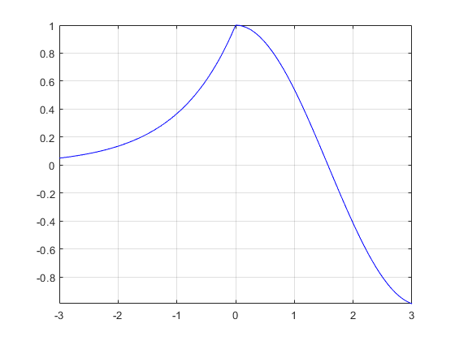
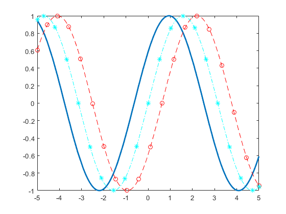
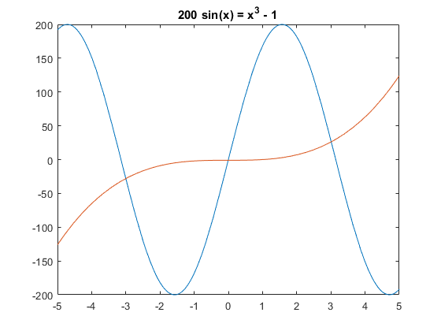
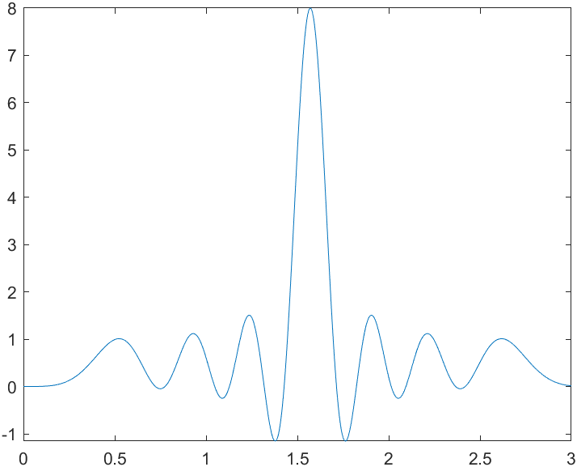
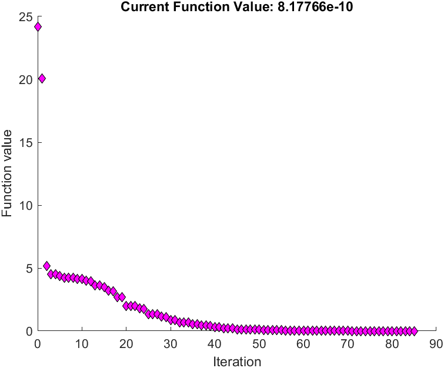

## 符号变量 syms

在MATLAB中创建或定义一个函数需要用到符号变量。一般情况下，想要绘制函数图像时，往往使用`x=[a:0.01:b]`的方式先创建一个x的离散定义域，然后再用`y=func(x)`的方式定义函数本身，最后使用plot(x,y)的方式绘制图像。

然而，当涉及到函数极值、求导、方程求解、连续图像绘制等问题时，这种方法就不够用了。

想要创建一个**符号函数**，我们首先要创建一个或多个**符号变量**，用以表示符号函数本身。其定义方式即为`syms x x1 x2`。其中`x,x1,x2` 都是符号变量，一个符号函数可以由多个符号变量组成。

符号变量可以有定义域，这里或称**限制条件**。

限制条件可以在定义时就加上，但往往是较为简单的条件，如*positive*, *real*, *integer* 等。

```matlab
% Create symbolic variables x and y, and assume that they are integers.
syms x y integer

% Create another variable z, and assume that it has a positive rational value.
syms z positive rational

% Check assumptions on each variable. For example, check assumptions set on the variable x.
assumptions(x)

% Clear assumptions on x, y, and z.
assume([x y z],'clear')
assumptions

% Create a 1-by-3 symbolic array a and assume that the array elements have real values.
syms a [1 3] real
assumptions
```

其次，我们也可以使用更加精确的方法进行限定，即使用`assume`命令。

```matlab
syms x
assume(0<x<4)
```

## 定义函数

```matlab
% 方法1 使用这种方法不用特意定义自变量
y = @(t) cos(3*t);

% 方法2 先定义自变量为符号变量再定义函数本身
syms x
fun = 0.5*x*(exp(-2*x)+exp(-1.5*x)+exp(-x))
```

## 快速绘制函数图像

MATLAB中的函数`fplot`可以迅速绘制一个符号函数的函数图像，并可以对其显示的x范围进行设定。

```matlab
fplot(fun)
fplot(fun,x,[1,2])
```

默认情况下，其绘制区间为`[-5, 5]`，但如果符号变量本身有定义域限制，则会优先其定义域，优先级最高的是在绘制函数中指定的绘制区间。

当然，`fplot`函数还可以绘制多条曲线、分段函数以及参数函数等，详见[帮助文档](https://ww2.mathworks.cn/help/matlab/ref/fplot.html)，这里给出几个简单常用例子。

指定绘图区间并绘制分段函数
$e^x\space −3<x<0$

$cos(x)\space 0<x<3$

```matlab
使用 hold on 绘制多个线条。使用 fplot 的第二个输入参数指定绘图区间。使用 'b' 将绘制的线条颜色指定为蓝色。在相同坐标区中绘制多个线条时，坐标轴范围会调整以容纳所有数据。
fplot(@(x) exp(x),[-3 0],'b')
hold on
fplot(@(x) cos(x),[0 3],'b')
hold off
grid on
```



当然，使用`fplot`方法绘制的图像也是可以进行样式自定义的：

```matlab
fplot(@(x) sin(x+pi/5),'Linewidth',2);
hold on
fplot(@(x) sin(x-pi/5),'--or');
fplot(@(x) sin(x),'-.*c')
hold off
```



## 解方程

MATLAB中有两种常用解方程的函数：`solve`和`vpasolve`。前者会返回一个符号解，它的做法就像人类手工推理一样，计算出所有的符号解。而后者则会计算方程的数值解，且只会返回其找到的第一个数值解。

当我们想要使用`vpasolve`算出某个x范围中的所有解时候，我们有两种方法：

### 1. 画出方程对应的函数图像，并传给`vpasolve`一个猜测起点

如给定方程$200*sin(x) = x^3 - 1$, 我们先画出它的图像进行观察：

```matlab
syms x
eqnLeft = 200*sin(x);
eqnRight = x^3 - 1;
fplot([eqnLeft eqnRight])
title([texlabel(eqnLeft) ' = ' texlabel(eqnRight)])
```



观察后发现，这个方程有三个解，分别在-3, 0, 4的附近，于是我们可以用以下语句找到其所有的三个解

```matlab
S1 = vpasolve(eqnLeft == eqnRight, x);
S2 = vpasolve(eqnLeft == eqnRight, x, -3);
S3 = vpasolve(eqnLeft == eqnRight, x, 4);
```

### 2. 使`vpasolve`拥有一个随机起点，并进行循环

```matlab
for n = 1:3
    S = vpasolve(f,x,[0,2],'Random',true)
end

```

### 3. 仅针对多项式函数

如果你的函数是一个标准的多相似函数，那么你可以使用`roots`函数一次性得到所有的解。详情请参阅[帮助文档](https://www.mathworks.com/help/matlab/ref/roots.html)。

## 寻找函数极大极小值

在MATLAB中似乎没有直接一键求出函数的最值的办法，但我们却可以用`fminsearch`求出某个点附近的极值。

与前面提到的解方程类似，由于该函数并不会直接的把全局最值给你，所以最好先把函数图像画出来，然后观察需要求的极值在那个点附近，然后使用`fminsearch`函数把相关点的横坐标解出，如果需要最值的值，再把这个横坐标带回去求值。

```matlab
syms x
y=real((1-exp(8*i*pi*cos(x)))/(1-exp(i*pi*cos(x))));
fplot(y,[0,3]);
fminsearch(matlabFunction(-y),1.5);
% ans = 1.5708

```



请注意，这里在search的时候我将y改为了-y，因为我要找的是极大值而非极小值。

接着，我们将函数y变为`matlabFunction`型变量，在根据刚才输出的值求出极值大小：

```matlab
q=matlabFunction(y)
q(1.5708)

```

于是，我们就找到了函数在该点附近的极值。

你甚至可以看到MATLAB的优化路径：

```matlab
options = optimset('PlotFcns',@optimplotfval);
fun = @(x)100*(x(2) - x(1)^2)^2 + (1 - x(1))^2;
x0 = [-1.2,1];
x = fminsearch(fun,x0,options)
```



## 对函数求导

定义好一个符号函数后，直接使用`diff`命令即可对函数进行符号求导。

```matlab
syms x
fun=0.5*x*(exp(-2*x)+exp(-1.5*x)+exp(-x))
diff(fun) % or diff(fun, x)

```

需要注意的一点是，`diff`函数不但对符号函数有效，其对数列也是有效的：

```matlab
X = [1 1 2 3 5 8 13 21];
Y = diff(X)
% Y = 1×7
%     0     1     1     2     3     5     8

```

